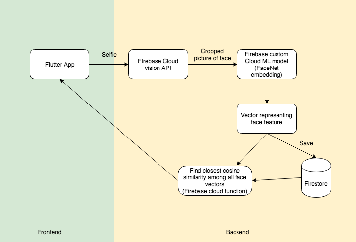

## Overview
This app is designed to solve the problem that in some events people keep coming back for swags. (Hope this isn't you)

This app will take a picture of you and remember you for the rest of the event.

#### Other potential use cases:
* food bank food giveaway
* [fighting toilet paper theft](https://www.theverge.com/2017/3/20/14986640/china-toilet-paper-theft-facial-recognition-machine)

## Design 

## Getting started

Run firebase functions locally
```
npm run shell
```

Deploy
```
firebase deploy
```

Format Dart directory
```
dartfmt . -w --fix
```
## Future area of work
* Integrate with a survey feature, and take a picture when they do the survey, so it doesn't look too creepy
* Add login and authentication
* Better UI?
